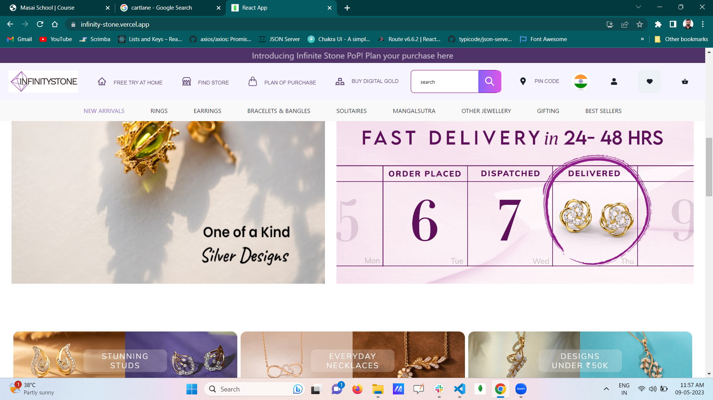
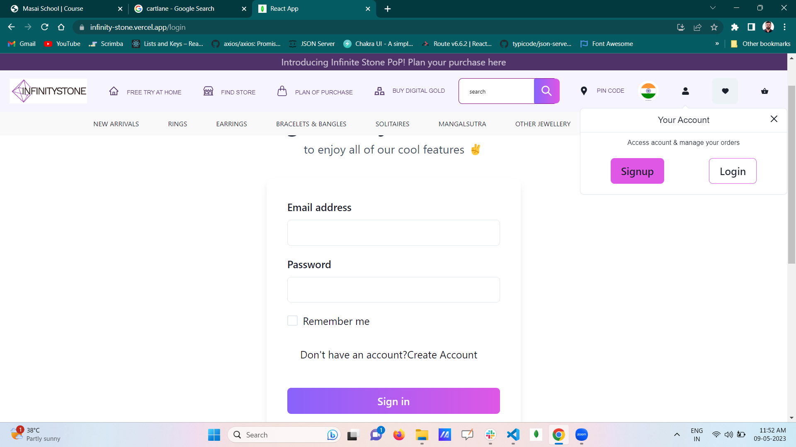
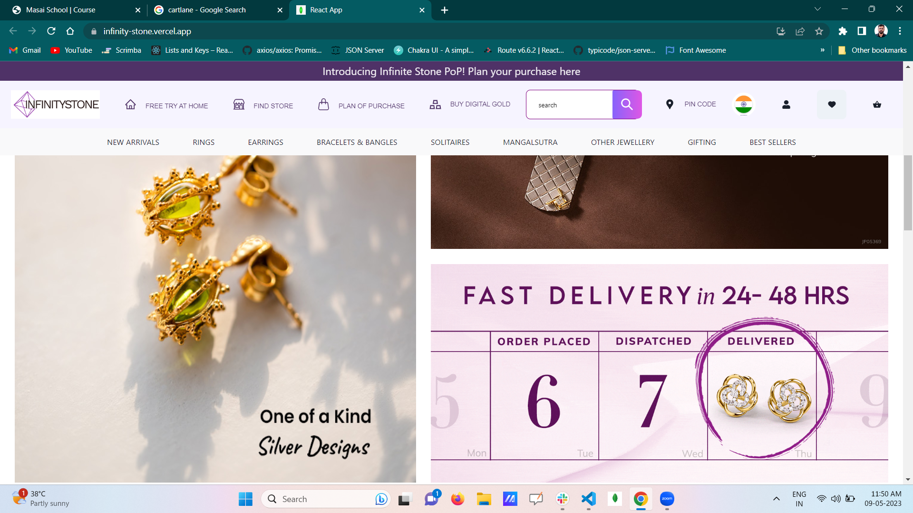
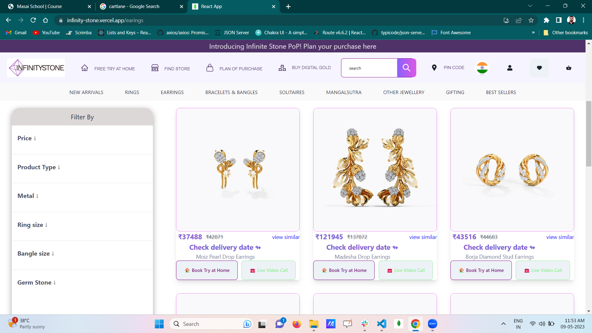
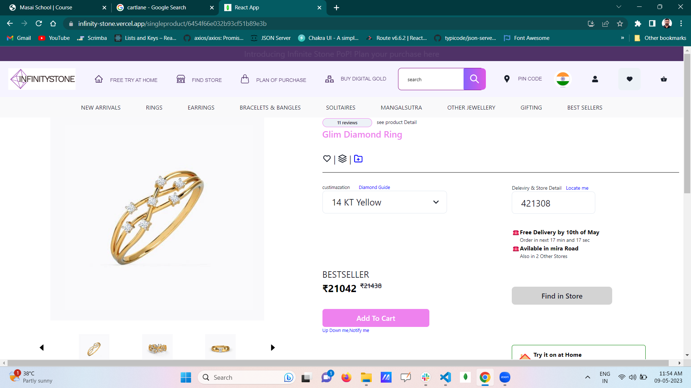
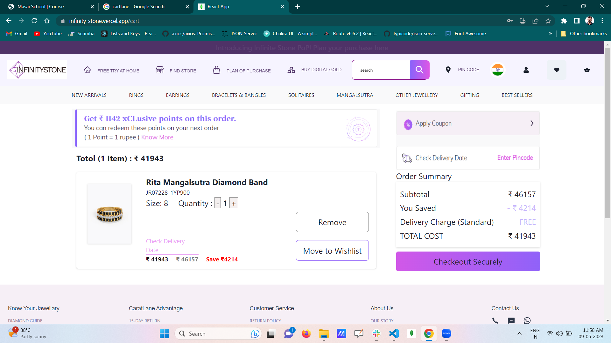
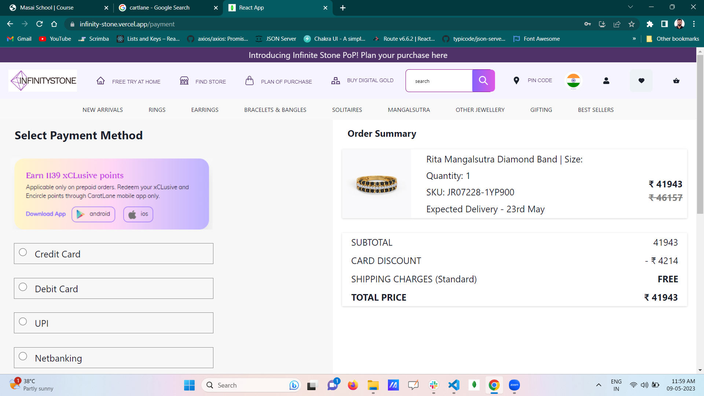
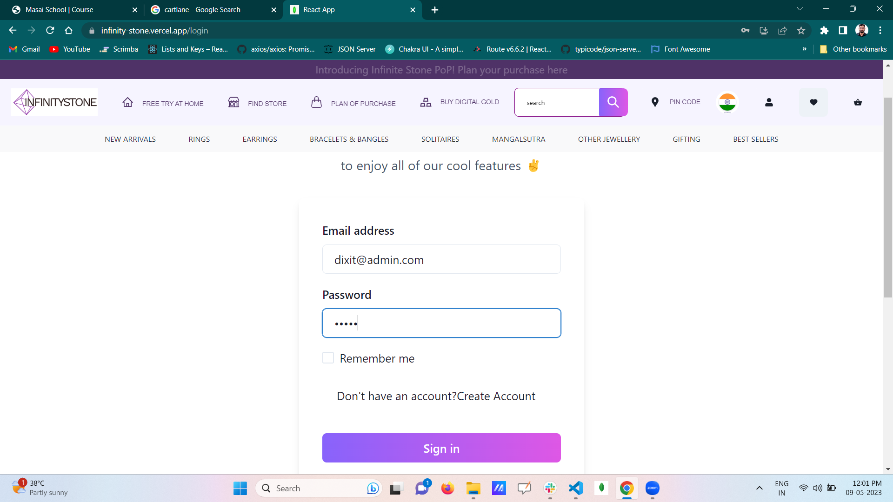
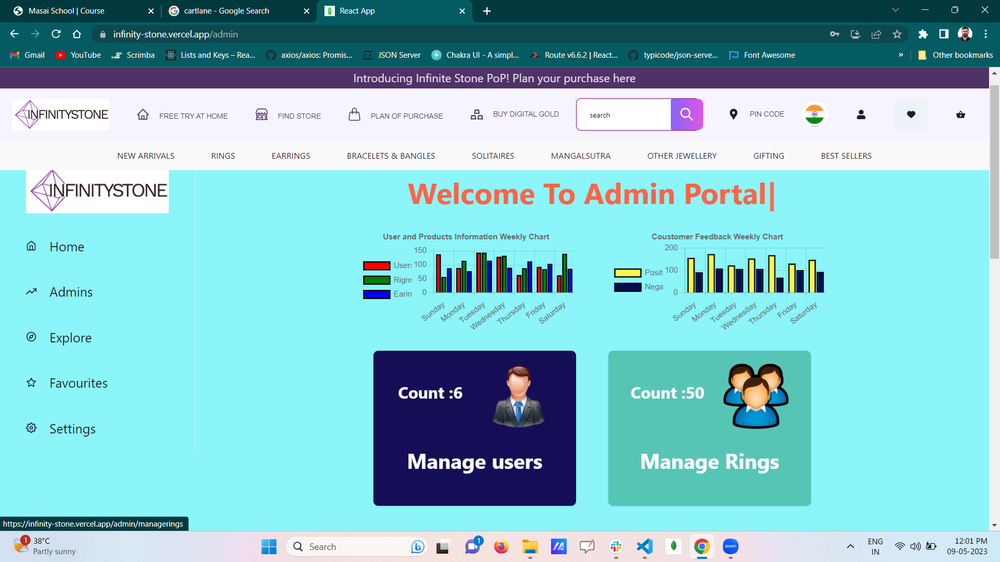

# FRONT-END

# Infinity Stone  (CaratLane- Clone)

CaratLane is an Indian physical and online jewelry retailer, headquartered in Chennai, India
Where you can purchase Rings , Earrings ect

A Full Stack , Collaborative project built by a team of 5 executed in 5 days.


## Demo  🎥

- Deployed Link:- [Enjoy the Experience](https://infinity-stone.vercel.app/)

## Tech Stack 💻

- React
- Redux
- Chakra -UI
- CSS
- MongoDB
- Mongoose
_ MongoDb Atlas

## Snapshots :camera:
* Landing page (Home page) 




* Sign-In page
 



* Landing page (Rings page) 




* Landing page (Earrings page) 





* Single Product page





* Cart page

 



* Payment page




* Admin Signin page





*Admin page





# BACK-END


# Infinity Stone Backend API


Deployed link: https://cartlane.onrender.com/

## Routes:

- /rings
- /earrings
- /users
- /cart
- /search

```
NOTE:
* All user routes require token in the response header.
* All admin routes require token in the response header generated after loging in with an user account with the role of admin.
```

## /rings

### Routes:

- **Open routes**:

1. `GET /` : get all products
2. `GET /:id` : get a product by its ID

- **Admin Routes:**

1. `POST /add` : create a new product
2. `PATCH /update/:id` : update a product by its ID
3. `DELETE /delete/:id` : delete a product

### Features:

#### `GET /`

- `page` and `limit` queries can be used for pagination.

```
https://cartlane.onrender.com/rings?page=1&limit=10
```

- Any key in the product schema can be used as a filter.

```
https://cartlane.onrender.com/rings?size=5
```

- For sorting by a field, pass the field in the query `type`. The query `sort` takes asc or desc to sort in ascending or descending order respectively.

```
https://cartlane.onrender.com/rings?type=price&sort=asc
```

- For comparative operators in queries, use the suffix `from` and `till` after any query for **greater than or equal to** or **less than or equal to** respectively.

```
https://cartlane.onrender.com/rings?from=1&till=10000
```

- For full-text search, use `q` query to pass in the keyword.

```
https://cartlane.onrender.com/search/?q=duo
```

### Product Schema

```
{
  imageurl:{type: String,required:true},
  image:{type: String,required:true},
  price:{type: Number,required:true},
  originalprice:{type: Number,required:true},
  title:{type: String,required:true},
  size:{type: Number,required:true},
}
```

## /earrings 

### Routes:

- **Open routes**:

1. `GET /` : get all products
2. `GET /:id` : get a product by its ID

- **Admin Routes:**

1. `POST /add` : create a new product
2. `PATCH /update/:id` : update a product by its ID
3. `DELETE /delete/:id` : delete a product

### Features:

#### `GET /`

- `page` and `limit` queries can be used for pagination.

```
https://cartlane.onrender.com/earrings?page=1&limit=10
```

- Any key in the product schema can be used as a filter.

```
https://cartlane.onrender.com/earrings?size=5
```

- For sorting by a field, pass the field in the query `type`. The query `sort` takes asc or desc to sort in ascending or descending order respectively.

```
https://cartlane.onrender.com/earrings?type=price&sort=asc
```

- For comparative operators in queries, use the suffix `from` and `till` after any query for **greater than or equal to** or **less than or equal to** respectively.

```
https://cartlane.onrender.com/earrings?from=1&till=10000
```

### Product Schema

```
{
  imageurl:{type: String,required:true},
  image:{type: String,required:true},
  price:{type: Number,required:true},
  originalprice:{type: Number,required:true},
  title:{type: String,required:true},
  size:{type: Number,required:true},
}
```

## /users

### Routes:

- **User Routes:**

1. `POST /register` : to register a new user
2. `POST /login` : user login

- **Admin Routes:**

1. `GET /all` : to get all users
2. `PATCH /update/:id` : to update a user by their ID
3. `DELETE /delete/:id` : to delete a user by their ID

### Features:

#### `POST /register`

- Attempting to register with the same email returns `{ message: "Email already exist" }`

- Successfull registration returns `{ message: "User successfully registered" }`

#### `POST /login`

- Sending an unregistered email returns `{ message: "Email is not registered" }`

- Sending the wrong password returns `{ message: "Wrong Password" }`

* Successfull login returns `{ message: "User successfully logged in", token }` where token is a randomly genererated string that can be used for authentication.

### User Schema:

```
{
  _id: ObjectId,
  name: { type: String, required: true },
  email: { type: String, required: true },
  gender: { type: String, required: true },
  password: { type: String,required: true },
}
```

## /cart

### Routes

- **User routes:**

1. `GET /` : get all cart items of the logged in user
2. `POST /add` : add item to cart (autogenerates userID and count). Increments the count if product already exists in cart
3. `PATCH /update/:id` : update a cart item
4. `DELETE /delete/:id` : delete a cart item by id

### Features

#### `GET /`

- `productID` gets populated by product data including fields like `_id`, `title`, `image`, `price`, `original_price`

#### `POST /`

- On adding a product, if the product already exists, the count of that product increments in the cart (upto a quantity limit), otherwise it gets added. The response looks like `{ data, message: "Product successfully added to cart" }`, where data is the cart item after updation.

### Cart Schema

```
{
  imageurl:{type: String,required:true},
  image:{type: String,required:true},
  price:{type: Number,required:true},
  originalprice:{type: Number,required:true},
  title:{type: String,required:true},
  size:{type: Number,required:true},
  quantity:{type: Number,required:true}
}
```

## Middlewares

1. **userAuth**: Verifies the token in header to check whether user is logged in. Applied on cart routes.
2. **adminAuth**: Verifies the token in header to check whether admin is logged in. Applied on admin routes.


## Contributors  😇


- 👤 [Vivek Singh Tomar](https://github.com/VivekTomar03)

-     Key-Responsibility -> Complete Admin Side

- 👤 [Anubhav Dixit](https://github.com/Anubhav0391)

-     Key-Responsibility -> Complete Backend

- 👤 [Mrunali Gabhane](https://github.com/MrunaliGabhane)

-     Key-Responsibility -> UI for Cartpage , Paymentpage , Addresspage 

- 👤 [Ritik Verma](https://github.com/Ritikve03)
-     Key-Responsibility ->Homepage , Login and Signup page

- 👤 [Sumit Kolipyaka](https://github.com/SG-Kolipyaka)

-     Key-Responsibility ->Productspage , SingalProductpage


## End Notes :

Throughout this project, I aimed to create a near-perfect replica of the original website by meticulously implementing its features and functionalities. This constructive experience has not only helped me gain confidence, but has also imparted valuable lessons that I can apply in real-world scenarios. As a result, I have successfully integrated most of the website's features and functionalities into my project.
